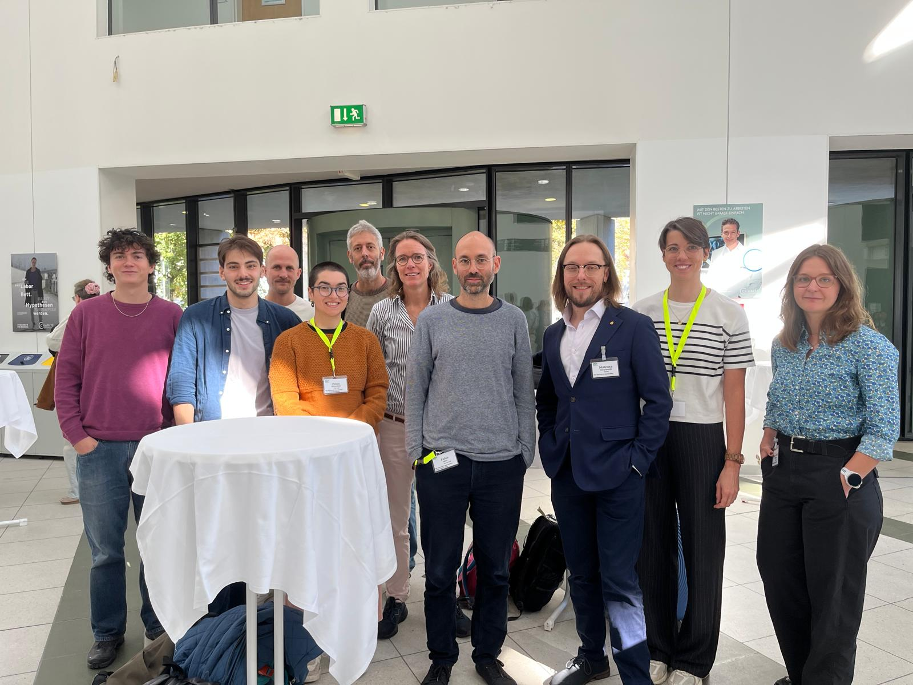

### Steering Committee {.unnumbered}
The CORTRE steering committee is composed of the following members:

- Samuel Gordon -- Jagiellonian University College of Medicine, Krakow, Poland
- Rachel Heyard -- University of Zurich, Zurich, Switzerland (Project co-lead)
- Fabio Molo -- University of Zurich, Zurich, Switzerland  (Project co-lead)
- Merle-Marie Pittelkow -- Charite, Berlin, Germany
- Priya Silverstein -- University of Coimbra, Coimbra, Portugal

### CORTRE working group members
In addition to the steering committee, the following researchers are actively contributing to the development of the CORTRE reporting guideline:  

- Olavo Amaral -- Universidade Federal do Rio de Janeiro, Rio de Janeiro, Brazil  
- Florian Neubauer -- RWI – Leibniz-Institut für Wirtschaftsforschung, Essen, Germany  
- Inge Stegeman -- University Medical Center Utrecht, Utrecht, The Netherlands  
- Mateusz Wasylewski -- Jagiellonian University College of Medicine, Krakow, Poland  
- Samuel Yelnosky -- Charite, Berlin, Germany  

### The CORTRE Team {.unnumbered}

